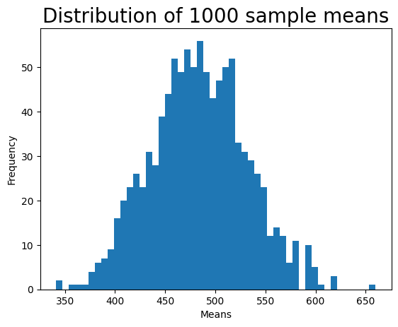

```python
import pandas as pd
import matplotlib.pyplot as plt
import numpy as np
import scipy.stats as st

# use gamma distribution to randomly generate 500 observations. 
shape, scale = 1.95, 2.5
tpcp = 100*np.random.gamma(shape, scale, 500)

# pandas library can be used to convert the array into a dataframe of rounded figures with the column name TPCP.
tpcp_df = pd.DataFrame(tpcp, columns=['TPCP'])
tpcp_df = tpcp_df.round(0)

# print the dataframe to see the first 5 and last 5 observations (note that the index of dataframe starts at 0).
print("TPCP data frame\n")
print(tpcp_df)
```

    TPCP data frame
    
           TPCP
    0     509.0
    1      56.0
    2     169.0
    3     611.0
    4     546.0
    ..      ...
    495  2180.0
    496   261.0
    497   359.0
    498   770.0
    499   441.0
    
    [500 rows x 1 columns]


```python
# create a figure for the plot. 
fig, ax = plt.subplots()

# create a histogram plot with 50 bins of TPCP population data. 
plt.hist(tpcp_df['TPCP'], bins=50)

# set a title for the plot, x-axis, and y-axis.
plt.title('TPCP population distribution', fontsize=20)
ax.set_xlabel('TPCP')
ax.set_ylabel('Frequency')

# show the plot.
plt.show()
```


    

    


```python
# You can use the "mean" method of a pandas dataframe.
pop_mean = tpcp_df['TPCP'].mean()
print("Population mean =", round(pop_mean,2))
```

    Population mean = 484.68


```python
# use sample method of the dataframe to select a random sample, with replacement, of size 50.
tpcp_sample_df = tpcp_df.sample(50, replace=True)

# print the sample mean.
sample_mean = tpcp_sample_df['TPCP'].mean()
print("Sample mean =", round(sample_mean,2))
```

    Sample mean = 470.06


```python
# run a for loop to repeat the process Step 4 one thousand times to select one thousand samples.
# save the mean of each sample that was drawn in a Python list called means_list.
means_list = []
for i in range(1000):
    tpcp_sample_df = tpcp_df.sample(50, replace=True)
    sample_mean = tpcp_sample_df['TPCP'].mean()
    means_list.append(sample_mean)
    
# create a Python dataframe of means.
means_df = pd.DataFrame(means_list, columns=['means'])
print("Dataframe of 1000 sample means\n")
print(means_df)
```

    Dataframe of 1000 sample means
    
          means
    0    414.62
    1    462.06
    2    535.38
    3    590.50
    4    436.02
    ..      ...
    995  491.20
    996  465.88
    997  484.24
    998  442.56
    999  559.00
    
    [1000 rows x 1 columns]


```python
# create a figure for the plot. 
fig, ax = plt.subplots()

# create a histogram plot with 50 bins of 1,000 means. 
plt.hist(means_df['means'], bins=50)

# set a title for the plot, x-axis and y-axis.
plt.title('Distribution of 1000 sample means', fontsize=20) # title
ax.set_xlabel('Means')
ax.set_ylabel('Frequency')

# show the plot.
plt.show()
```


    

    


```python
# calculate mean of the 1,000 sample means (this is called the grand mean or mean of the means).
mean1000 = means_df['means'].mean()
print("Grand Mean (Mean of 1000 sample means) =",round(mean1000,2))

# calculate standard deviation of the 1,000 sample means.
std1000 = means_df['means'].std()
print("Std Deviation of 1000 sample means =",round(std1000,2))

# print the probability that a specific mean is 450 or less for a Normal distribution with mean and standard deviation of 1,000 sample means.
prob_450_less_or_equal = st.norm.cdf(450, mean1000, std1000)
print("Probability that a specific mean is 450 or less =", round(prob_450_less_or_equal,4))
```

    Grand Mean (Mean of 1000 sample means) = 483.69
    Std Deviation of 1000 sample means = 47.61
    Probability that a specific mean is 450 or less = 0.2396


```python

```
