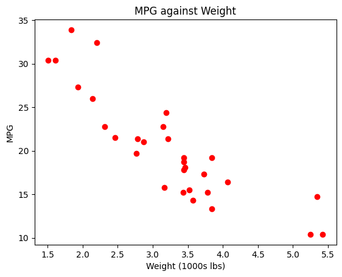
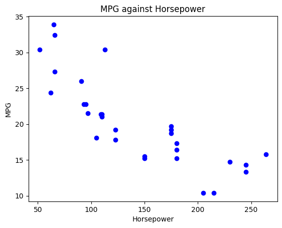

```python
import pandas as pd
from IPython.display import display, HTML

# read data from mtcars.csv data set.
cars_df_orig = pd.read_csv("https://s3-us-west-2.amazonaws.com/data-analytics.zybooks.com/mtcars.csv")

# randomly pick 30 observations from the data set to make the data set unique to you.
cars_df = cars_df_orig.sample(n=30, replace=False)

# print only the first five observations in the dataset.
print("Cars data frame (showing only the first five observations)\n")
display(HTML(cars_df.head().to_html()))
```

    Cars data frame (showing only the first five observations)
    


<table border="1" class="dataframe">
  <thead>
    <tr style="text-align: right;">
      <th></th>
      <th>Unnamed: 0</th>
      <th>mpg</th>
      <th>cyl</th>
      <th>disp</th>
      <th>hp</th>
      <th>drat</th>
      <th>wt</th>
      <th>qsec</th>
      <th>vs</th>
      <th>am</th>
      <th>gear</th>
      <th>carb</th>
    </tr>
  </thead>
  <tbody>
    <tr>
      <th>1</th>
      <td>Mazda RX4 Wag</td>
      <td>21.0</td>
      <td>6</td>
      <td>160.0</td>
      <td>110</td>
      <td>3.90</td>
      <td>2.875</td>
      <td>17.02</td>
      <td>0</td>
      <td>1</td>
      <td>4</td>
      <td>4</td>
    </tr>
    <tr>
      <th>6</th>
      <td>Duster 360</td>
      <td>14.3</td>
      <td>8</td>
      <td>360.0</td>
      <td>245</td>
      <td>3.21</td>
      <td>3.570</td>
      <td>15.84</td>
      <td>0</td>
      <td>0</td>
      <td>3</td>
      <td>4</td>
    </tr>
    <tr>
      <th>5</th>
      <td>Valiant</td>
      <td>18.1</td>
      <td>6</td>
      <td>225.0</td>
      <td>105</td>
      <td>2.76</td>
      <td>3.460</td>
      <td>20.22</td>
      <td>1</td>
      <td>0</td>
      <td>3</td>
      <td>1</td>
    </tr>
    <tr>
      <th>26</th>
      <td>Porsche 914-2</td>
      <td>26.0</td>
      <td>4</td>
      <td>120.3</td>
      <td>91</td>
      <td>4.43</td>
      <td>2.140</td>
      <td>16.70</td>
      <td>0</td>
      <td>1</td>
      <td>5</td>
      <td>2</td>
    </tr>
    <tr>
      <th>23</th>
      <td>Camaro Z28</td>
      <td>13.3</td>
      <td>8</td>
      <td>350.0</td>
      <td>245</td>
      <td>3.73</td>
      <td>3.840</td>
      <td>15.41</td>
      <td>0</td>
      <td>0</td>
      <td>3</td>
      <td>4</td>
    </tr>
  </tbody>
</table>


```python
import matplotlib.pyplot as plt

# create scatterplot of variables mpg against wt.
plt.plot(cars_df["wt"], cars_df["mpg"], 'o', color='red')

# set a title for the plot, x-axis, and y-axis.
plt.title('MPG against Weight')
plt.xlabel('Weight (1000s lbs)')
plt.ylabel('MPG')

# show the plot.
plt.show()
```


    

    


```python
import matplotlib.pyplot as plt

# create scatterplot of variables mpg against hp.
plt.plot(cars_df["hp"], cars_df["mpg"], 'o', color='blue')

# set a title for the plot, x-axis, and y-axis.
plt.title('MPG against Horsepower')
plt.xlabel('Horsepower')
plt.ylabel('MPG')

# show the plot.
plt.show()
```


    

    


```python
# create correlation matrix for mpg, wt, and hp. 
# The correlation coefficient between mpg and wt is contained in the cell for mpg row and wt column (or wt row and mpg column).
# The correlation coefficient between mpg and hp is contained in the cell for mpg row and hp column (or hp row and mpg column).
mpg_wt_corr = cars_df[['mpg','wt','hp']].corr()
print(mpg_wt_corr)
```

              mpg        wt        hp
    mpg  1.000000 -0.872752 -0.819157
    wt  -0.872752  1.000000  0.721945
    hp  -0.819157  0.721945  1.000000


```python
from statsmodels.formula.api import ols

# create the multiple regression model with mpg as the response variable; weight and horsepower as predictor variables.
model = ols('mpg ~ wt+hp', data=cars_df).fit()
print(model.summary())
```

                                OLS Regression Results                            
    ==============================================================================
    Dep. Variable:                    mpg   R-squared:                       0.836
    Model:                            OLS   Adj. R-squared:                  0.824
    Method:                 Least Squares   F-statistic:                     69.00
    Date:                Sat, 13 May 2023   Prob (F-statistic):           2.44e-11
    Time:                        00:57:31   Log-Likelihood:                -69.427
    No. Observations:                  30   AIC:                             144.9
    Df Residuals:                      27   BIC:                             149.1
    Df Model:                           2                                         
    Covariance Type:            nonrobust                                         
    ==============================================================================
                     coef    std err          t      P>|t|      [0.025      0.975]
    ------------------------------------------------------------------------------
    Intercept     37.4950      1.611     23.277      0.000      34.190      40.800
    wt            -3.6050      0.690     -5.223      0.000      -5.021      -2.189
    hp            -0.0398      0.011     -3.510      0.002      -0.063      -0.017
    ==============================================================================
    Omnibus:                        4.856   Durbin-Watson:                   1.011
    Prob(Omnibus):                  0.088   Jarque-Bera (JB):                3.495
    Skew:                           0.815   Prob(JB):                        0.174
    Kurtosis:                       3.371   Cond. No.                         549.
    ==============================================================================
    
    Notes:
    [1] Standard Errors assume that the covariance matrix of the errors is correctly specified.


```python

```
