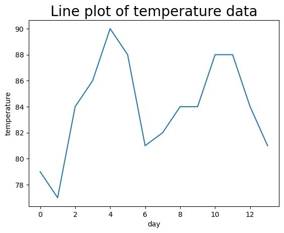

# Descriptive Statistics

---

```python
# This module will be used to prepare a pandas dataframe and calculate descriptive statistics
import pandas as pd

# input your data in the Python list below. 
# For example, if your temperature data is:  81, 79, 80, 85, 83, 85, 87, 84, 84, 88, 85, 87
# then the step below should be set as:   temperatures = [81, 79, 80, 85, 83, 85, 87, 84, 84, 88, 85, 87]
temperatures = [79, 77, 84, 86, 90, 88, 81, 82, 84, 84, 88, 88, 84, 81]

# prepare a dataframe for temperatures.
temperatures_df = pd.DataFrame(temperatures, columns=['temperature'])

# print temperatures dataframe
print(temperatures_df)
```

        temperature
    0            79
    1            77
    2            84
    3            86
    4            90
    5            88
    6            81
    7            82
    8            84
    9            84
    10           88
    11           88
    12           84
    13           81


```python
# Pandas dataframe has several methods that calculate descriptive statistics. 

# mean
mean = temperatures_df['temperature'].mean()
print("Mean=", round(mean,2))

# median
median = temperatures_df['temperature'].median()
print("Median=", round(median,2))

# variance
variance = temperatures_df['temperature'].var()
print("Variance=", round(variance,2))

# standard deviation
stdeviation = temperatures_df['temperature'].std()
print("Standard Deviation=", round(stdeviation,2))

# describe - a useful function that calculates several different descriptive statistics
statistics = temperatures_df['temperature'].describe()
print("")
print ("Describe method")
print (statistics)
```

    Mean= 84.0
    Median= 84.0
    Variance= 14.15
    Standard Deviation= 3.76
    
    Describe method
    count    14.00000
    mean     84.00000
    std       3.76216
    min      77.00000
    25%      81.25000
    50%      84.00000
    75%      87.50000
    max      90.00000
    Name: temperature, dtype: float64


```python
import matplotlib.pyplot as plt

# line chart
plt.plot(temperatures_df['temperature']) # plot

# setting a title for the plot, x-axis and y-axis
plt.title('Line plot of temperature data', fontsize=20) 
plt.xlabel('day')
plt.ylabel('temperature')

# show the plot
plt.show()
```


    

    


```python
import matplotlib.pyplot as plt
import seaborn as sns
import numpy as np
import random

# creates temperature data for Zion. You don't need to know how this data is created. 
# The temperature data created for Zion will be unique to you. 
mean = random.randint(temperatures_df['temperature'].min(),temperatures_df['temperature'].max())
std_deviation = random.randint(round(temperatures_df['temperature'].std(),0),round(2*temperatures_df['temperature'].std(),0))
zion_temperatures = np.random.normal(mean, std_deviation, 25)
zion_temperatures = pd.DataFrame(zion_temperatures, columns=['temperature'])

# side-by-side boxplots require the two dataframes to be concatenated and require a variable identifying the data
temperatures_df['id'] = 'my_data'
zion_temperatures['id'] = 'zion_data'
both_temp_df = pd.concat((temperatures_df, zion_temperatures))

# sets a title for the plot, x-axis, and y-axis
plt.title('Boxplot for comparison', fontsize=20) 

# prepares the boxplot
sns.boxplot(x="id",y="temperature",data=both_temp_df)

# shows the plot
plt.show()
```


    

    


```python

```
[Next: Module 2 - The Central Limit Theorem](../The_Central_Limit_Theorem/README.md)
