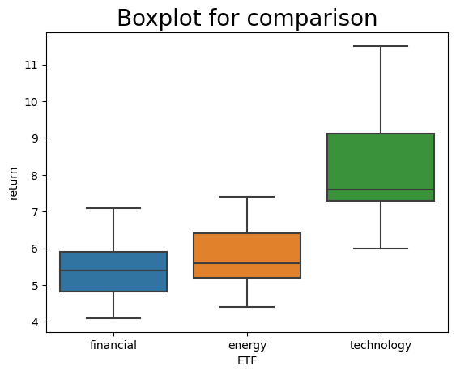

# One-Way ANOVA

---

```python
import pandas as pd

# read data from etf_returns.csv.
etf_returns_df = pd.read_csv('etf_returns.csv')

# print etf returns data set.
print(etf_returns_df)
```

        financial  energy  technology
    0         5.5     5.2         7.3
    1         7.1     7.4         8.2
    2         6.9     6.6         7.1
    3         5.1     5.7         7.6
    4         4.6     5.6         8.2
    5         5.3     5.5        11.5
    6         5.9     6.4         9.2
    7         5.6     6.1         9.5
    8         5.5     5.2         7.3
    9         7.1     7.4         8.2
    10        6.9     6.6         7.1
    11        5.1     5.7         7.6
    12        4.6     5.6         8.2
    13        5.3     5.5        11.5
    14        5.9     6.4         9.2
    15        5.6     6.1         9.5
    16        4.7     4.4         6.2
    17        6.4     6.6         7.4
    18        6.7     6.4         6.9
    19        4.3     4.8         6.4
    20        4.1     5.0         7.4
    21        5.1     5.3        11.1
    22        5.7     6.2         8.9
    23        4.7     5.2         8.1
    24        5.3     5.0         7.1
    25        6.4     6.6         7.4
    26        5.8     5.6         6.0
    27        4.9     5.5         7.4
    28        4.1     5.0         7.4
    29        4.8     4.9        10.3


```python
import scipy.stats as st

# save return data for individual sectors for input to f_oneway method.
etf_returns_financial = etf_returns_df['financial']
etf_returns_energy = etf_returns_df['energy']
etf_returns_technology = etf_returns_df['technology']

# print the outputs: the test statistic and the P-value.
test_statistic, p_value = st.f_oneway(etf_returns_financial, etf_returns_energy, etf_returns_technology)

print("test statistic =", round(test_statistic,2))
print("P-value =", round(p_value,4))
```

    test statistic = 55.07
    P-value = 0.0


```python
import matplotlib.pyplot as plt
import seaborn as sns
import numpy as np
import random

# side-by-side boxplots require the three dataframes to be concatenated and a require variable identifying the type of ETF.
etf_returns_financial_df = etf_returns_df[['financial']]
etf_returns_financial_df = etf_returns_financial_df.rename(columns={"financial": "return"})
etf_returns_financial_df['ETF'] = 'financial'

etf_returns_energy_df = etf_returns_df[['energy']]
etf_returns_energy_df = etf_returns_energy_df.rename(columns={"energy": "return"})
etf_returns_energy_df['ETF'] = 'energy'

etf_returns_technology_df = etf_returns_df[['technology']]
etf_returns_technology_df = etf_returns_technology_df.rename(columns={"technology": "return"})
etf_returns_technology_df['ETF'] = 'technology'

# concatenate dataframes for the three ETFs.
all_etfs_df = pd.concat((etf_returns_financial_df, etf_returns_energy_df, etf_returns_technology_df))

# set a title for the plot, x-axis, and y-axis.
plt.title('Boxplot for comparison', fontsize=20) 

# prepare the boxplot.
sns.boxplot(x="ETF",y="return",data=all_etfs_df)

# show the plot.
plt.show()
```


    

    


```python

```
[BACK](https://x10mrrobot01x.github.io)
