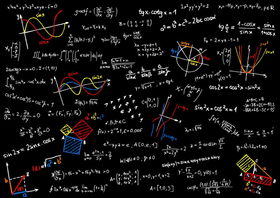

# Notes in Applied Statistics for STEM

- **[Module 1 - Descriptive Statistics](/Descriptive_Statistics/README.md)**
- **[Module 2 - The Central Limit Theorem](/The_Central_Limit_Theorem/README.md)**
- **[Module 3 - Confidence Intervals and Hypothesis Testing](/Confidence_Intervals_and_Hypothesis_Testing/README.md)**
- **[Module 4 - Hypothesis Testing for the Difference Between Two Population Parameters](/Hypothesis_Testing_for_the_Difference_Between_Two_Population_Parameters/README.md)**
- **[Module 5 - Simple Linear Regression](/Simple_Linear_Regression/README.md)**
- **[Module 6 - Creating a Multiple Regression Model](/Creating_a_Multiple_Regression_Model/README.md)**
- **[Module 7 - Interpreting Multiple Regression Models](/Interpreting_Multiple_Regression_Models/README.md)**
- **[Module 8 - One-Way ANOVA](/One-Way_ANOVA/README.md)**
