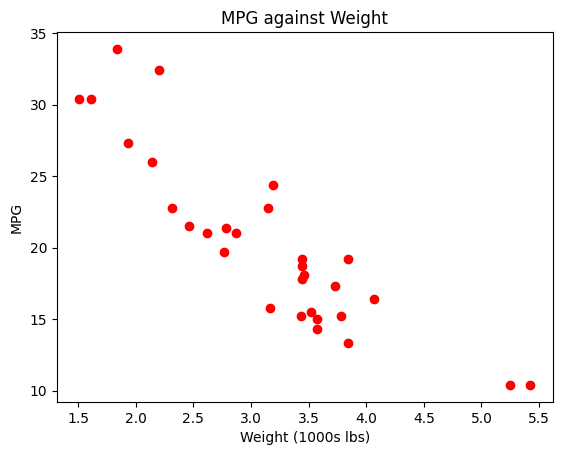

```python
import pandas as pd
from IPython.display import display, HTML

# read data from mtcars.csv data set.
cars_df_orig = pd.read_csv("https://s3-us-west-2.amazonaws.com/data-analytics.zybooks.com/mtcars.csv")

# randomly pick 30 observations without replacement from mtcars dataset to make the data unique to you.
cars_df = cars_df_orig.sample(n=30, replace=False)

# print only the first five observations in the data set.
print("\nCars data frame (showing only the first five observations)")
display(HTML(cars_df.head().to_html()))
```

    
    Cars data frame (showing only the first five observations)


<table border="1" class="dataframe">
  <thead>
    <tr style="text-align: right;">
      <th></th>
      <th>Unnamed: 0</th>
      <th>mpg</th>
      <th>cyl</th>
      <th>disp</th>
      <th>hp</th>
      <th>drat</th>
      <th>wt</th>
      <th>qsec</th>
      <th>vs</th>
      <th>am</th>
      <th>gear</th>
      <th>carb</th>
    </tr>
  </thead>
  <tbody>
    <tr>
      <th>17</th>
      <td>Fiat 128</td>
      <td>32.4</td>
      <td>4</td>
      <td>78.7</td>
      <td>66</td>
      <td>4.08</td>
      <td>2.200</td>
      <td>19.47</td>
      <td>1</td>
      <td>1</td>
      <td>4</td>
      <td>1</td>
    </tr>
    <tr>
      <th>0</th>
      <td>Mazda RX4</td>
      <td>21.0</td>
      <td>6</td>
      <td>160.0</td>
      <td>110</td>
      <td>3.90</td>
      <td>2.620</td>
      <td>16.46</td>
      <td>0</td>
      <td>1</td>
      <td>4</td>
      <td>4</td>
    </tr>
    <tr>
      <th>2</th>
      <td>Datsun 710</td>
      <td>22.8</td>
      <td>4</td>
      <td>108.0</td>
      <td>93</td>
      <td>3.85</td>
      <td>2.320</td>
      <td>18.61</td>
      <td>1</td>
      <td>1</td>
      <td>4</td>
      <td>1</td>
    </tr>
    <tr>
      <th>6</th>
      <td>Duster 360</td>
      <td>14.3</td>
      <td>8</td>
      <td>360.0</td>
      <td>245</td>
      <td>3.21</td>
      <td>3.570</td>
      <td>15.84</td>
      <td>0</td>
      <td>0</td>
      <td>3</td>
      <td>4</td>
    </tr>
    <tr>
      <th>18</th>
      <td>Honda Civic</td>
      <td>30.4</td>
      <td>4</td>
      <td>75.7</td>
      <td>52</td>
      <td>4.93</td>
      <td>1.615</td>
      <td>18.52</td>
      <td>1</td>
      <td>1</td>
      <td>4</td>
      <td>2</td>
    </tr>
  </tbody>
</table>


```python
import matplotlib.pyplot as plt

# create scatterplot of variables mpg against wt.
plt.plot(cars_df["wt"], cars_df["mpg"], 'o', color='red')

# set a title for the plot, x-axis, and y-axis.
plt.title('MPG against Weight')
plt.xlabel('Weight (1000s lbs)')
plt.ylabel('MPG')

# show the plot.
plt.show()
```


    

    


```python
# create correlation matrix for mpg and wt. 
# the correlation coefficient between mpg and wt is contained in the cell for mpg row and wt column (or wt row and mpg column) 
mpg_wt_corr = cars_df[['mpg','wt']].corr()
print(mpg_wt_corr)
```

              mpg        wt
    mpg  1.000000 -0.887689
    wt  -0.887689  1.000000


```python
from statsmodels.formula.api import ols

# create the simple linear regression model with mpg as the response variable and weight as the predictor variable
model = ols('mpg ~ wt', data=cars_df).fit()

#print the model summary
print(model.summary())
```

                                OLS Regression Results                            
    ==============================================================================
    Dep. Variable:                    mpg   R-squared:                       0.788
    Model:                            OLS   Adj. R-squared:                  0.780
    Method:                 Least Squares   F-statistic:                     104.1
    Date:                Sat, 13 May 2023   Prob (F-statistic):           6.18e-11
    Time:                        00:51:22   Log-Likelihood:                -73.257
    No. Observations:                  30   AIC:                             150.5
    Df Residuals:                      28   BIC:                             153.3
    Df Model:                           1                                         
    Covariance Type:            nonrobust                                         
    ==============================================================================
                     coef    std err          t      P>|t|      [0.025      0.975]
    ------------------------------------------------------------------------------
    Intercept     38.7087      1.886     20.520      0.000      34.845      42.573
    wt            -5.8740      0.576    -10.201      0.000      -7.053      -4.695
    ==============================================================================
    Omnibus:                        2.598   Durbin-Watson:                   1.403
    Prob(Omnibus):                  0.273   Jarque-Bera (JB):                2.201
    Skew:                           0.646   Prob(JB):                        0.333
    Kurtosis:                       2.701   Cond. No.                         12.8
    ==============================================================================
    
    Notes:
    [1] Standard Errors assume that the covariance matrix of the errors is correctly specified.


```python

```
